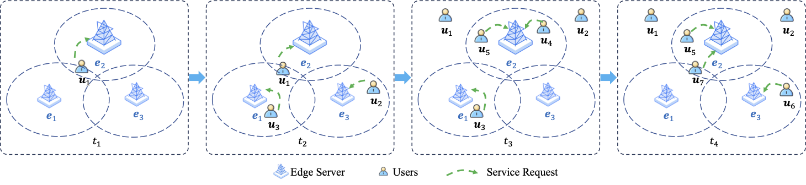
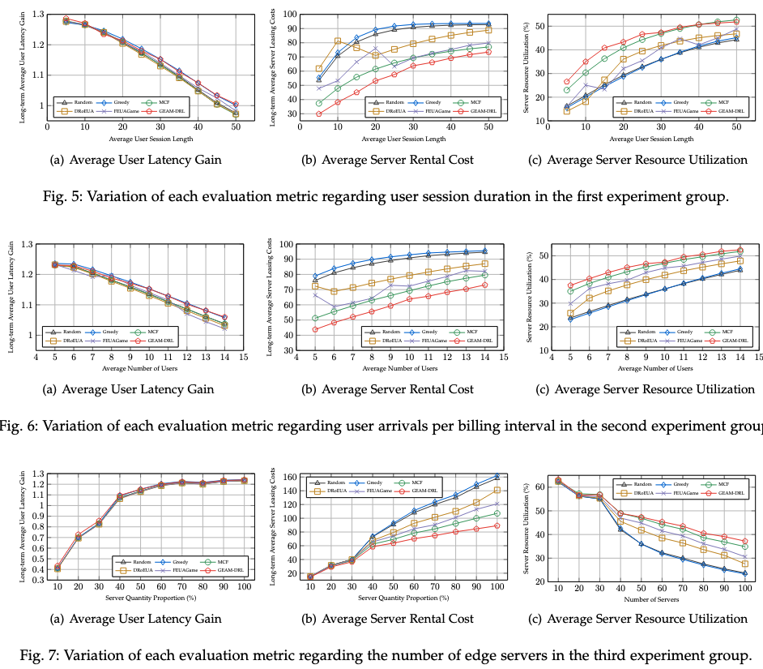

# GEAM-DRL

## Introduction

Mobile edge computing deploys computational resources closer to the data sources to support low-latency services. However, edge servers have limited resources and coverage areas, making it challenging to dynamically assign mobile users to the best possible edge servers. While existing methods can achieve optimal solutions in small-scale scenarios, they struggle to meet the demands of massive user dynamism and real-time allocation. In this study, we address this problem, called dynamic edge user assignment (EUA), through a graph encoding attention model based on deep reinforcement learning (GEAM-DRL). To precisely capture the relationship and distance between edge servers, we employ a graph neural network (GNN); by simplifying the GNN decoder, we notably speed up model inference, thus ensuring real-time requirements of dynamic EUA. Experiments based on a real-world dataset demonstrate that, compared to current state-of-the-art methods, our model significantly optimizes user latency, reducing it by 12%, and lowers the long-term average leasing cost of edge servers, saving between 10% and 15%. Thus, our approach can make an optimal trade-off by enhancing cost-effectiveness while ensuring real-time performance for dynamic EUA.

## Main Results

# Edge User Allocation

This project is the code implementation of edge user allocation, using a Graph Encoding Attention Network for user assignment.

## Project Structure

- data: Dataset
- my_env: Environment (Not using "env" to avoid conflicts with Python's "env")
- nets: Network models
- utils: Utilities
- train.py: Training
- config.yaml: Configuration file
- generate_dataset.py: Dataset generation
- test_methods.py: Testing methods
- test_methods.time: Runtime of testing methods

### data
- data_generator.py: Data generator
- eua_dataset.py: Dataset class in PyTorch
- site-optus-melbCBD: Melbourne CBD dataset, mainly considering LATITUDE, LONGITUDE features

### my_env
- deua_env.py: Dynamic EUA environment

### nets
- attention_net.py: Graph Encoding Attention Network
- attention_net_to_calc_time.py: A Graph Encoding Attention Network for time calculation, which can load the original network after training and compute time.

### utils
- utils.py: Utility class
- torch_utils.py: PyTorch utilities
- Other files: Comparison methods

## Project Setup

First, configure the working directory in `config.yaml`. This directory will be used for both dataset generation and storing the trained models.  
Then, generate the dataset by running `generate_dataset.py`. Make sure to configure dataset size, parameters, etc. These parameters are independent from those in `config.yaml`, which are specifically for training.  
Next, run `train.py` to train the model. After training, the model will be saved and can be used for testing.

To run comparison methods, execute `test_methods.py`, which contains calls to comparison methods that you can invoke as needed.  

If you want to test the runtime of the comparison methods and this method, run `test_methods.time`, which compares the runtime of the comparison methods and the proposed method.

## Project Dependencies
- python==3.11.5  
- pytorch==2.1.1  
- dgl==1.1.2.cu118  
- numpy==1.24.3  
- yaml==0.2.5  
- tqdm==4.65.0
